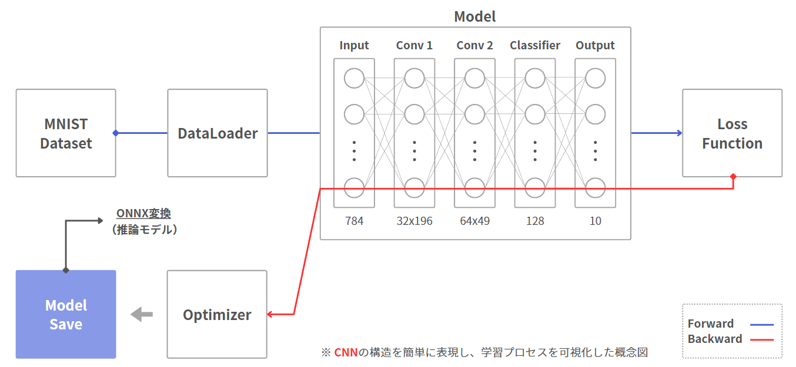
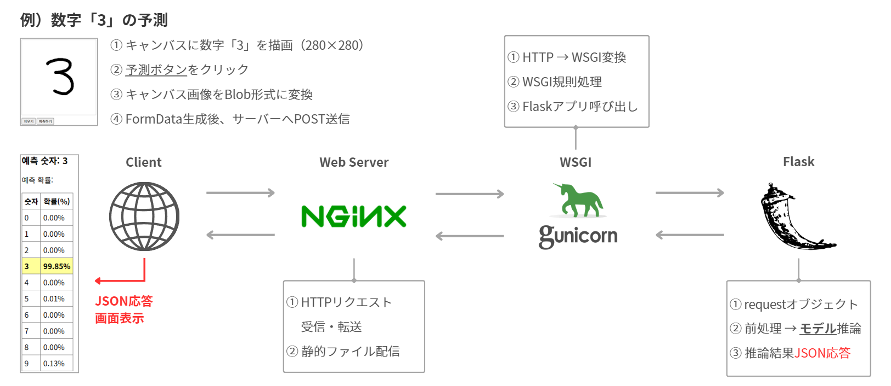

# MNIST 손글씨 숫자 인식

MNIST 데이터셋을 활용하여 CNN 기반 손글씨 숫자 인식 모델을 학습하고,  
Web 환경에서 실시간으로 예측 결과를 확인할 수 있는 AI 서비스를 구현한 프로젝트입니다.

---

## 프로젝트 개요

### MNIST란?

손글씨 숫자(0~9)로 구성된 대표적인 이미지 데이터셋입니다.

- 28×28 크기의 흑백 이미지
- 딥러닝 학습 및 실습에 가장 널리 사용
- 빠른 학습 및 테스트 가능

---

### 프로젝트 목표

Web 기반 손글씨 숫자 인식 AI 서비스 구축

- 딥러닝 모델 학습 및 성능 검증  
- ONNX 변환을 통한 모델 배포 과정 이해  
- 실시간 예측이 가능한 Web 시스템 구현  

학습부터 서비스 제공까지 AI 시스템 전체 흐름 이해

---

## 기능

### 1. CNN 모델 학습 및 ONNX 변환

PyTorch를 이용해 CNN 모델을 학습하고,  
추론 및 배포를 위해 ONNX 형식으로 변환합니다.



---

### 2. 실시간 추론

변환된 ONNX 모델을 ONNX Runtime으로 로드하여  
입력된 숫자를 실시간으로 예측합니다.


---

### 3. Flask REST API

Flask 기반 REST API를 구축하여  
이미지 입력을 받아 예측 결과를 JSON 형태로 반환합니다.



---

### 4. 웹 캔버스 손글씨 입력 및 인식

웹 페이지의 Canvas에서 직접 숫자를 작성하고  
AI 모델이 즉시 인식 결과를 출력합니다.

🎥 데모 영상  


---

## 프로젝트 구조

```
mnist/
├── 01_train.py          # 모델 학습
├── 02_export_onnx.py    # ONNX 변환
├── 03_server.py         # Flask 서버
├── static/
│   └── mnist.html       # 손글씨 캔버스 UI
├── models/
│   ├── mnist.pth        # PyTorch 모델
│   └── mnist.onnx       # ONNX 모델
├── requirements.txt
├── render.yaml          # Render 배포 설정
└── images/
    ├── train_onnx.png
    ├── inference.png
    ├── flask_api.png
    └── demo.gif
```

## 설치

```bash
# 가상환경 생성
python -m venv venv
source venv/bin/activate  # Windows: venv\Scripts\activate

# 의존성 설치
pip install -r requirements.txt
```

## 사용법

### 1. 모델 학습

```bash
python 01_train.py
```

학습된 모델이 `models/mnist.pth`에 저장됩니다.

### 2. ONNX 변환

```bash
python 02_export_onnx.py
```

ONNX 모델이 `models/mnist.onnx`에 저장됩니다.

### 3. 서버 실행

```bash
python 03_server.py
```

- 메인 페이지: http://localhost:5000
- 손글씨 캔버스: http://localhost:5000/contents/mnist.html

### API 사용

```bash
curl -X POST -F "file=@digit.png" http://localhost:5000/predict
```

응답 예시:
```json
{
  "prediction": 7,
  "probabilities": [0.01, 0.02, ...]
}
```

## 배포 (Render)

1. GitHub에 푸시
2. [Render](https://render.com)에서 Web Service 생성
3. 레포지토리 연결 후 배포

`render.yaml` 설정이 자동으로 적용됩니다.

## 모델 구조

```
Conv2d(1, 32) → ReLU → MaxPool2d
Conv2d(32, 64) → ReLU → MaxPool2d
Flatten → Linear(3136, 128) → ReLU → Linear(128, 10)
```

## 기술 스택

- **학습**: PyTorch, torchvision
- **추론**: ONNX Runtime
- **서버**: Flask, Gunicorn
- **배포**: Render

---

## 구현 결과 및 개선 사항

### 구현 결과

- CNN 기반 고정확도 손글씨 숫자 인식 모델 구축  
- Web 서비스 상에서 실시간 숫자 인식 기능 구현  

AI와 Web을 연동한 실시간 인식 시스템 완성

---

### 개선 사항

- 입력 이미지 중심화 전처리 추가  
- 학습 시 평행 이동 데이터 증강 적용  

위치 변화의 영향을 덜 받는 인식 모델로 성능 개선

---

## 성장 포인트

AI 모델 개발 이해 및 구현 경험  
+  
Web 서비스와의 연동 및 배포 경험  

=  

기술을 통합하여 실제 서비스 형태로 완성하는 개발 역량 향상