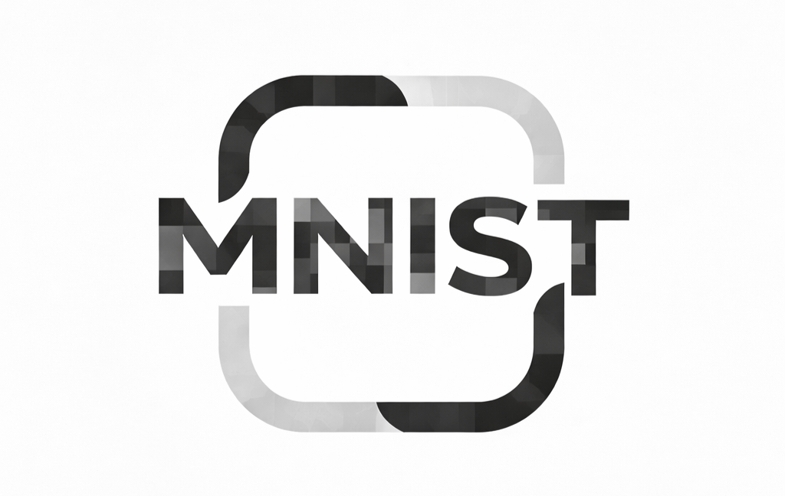

# MNIST 手書き数字認識

[](https://www.python.org/)
[](https://pytorch.org/)
[](LICENSE)

[한국어](README_ko.md)

MNISTデータセットを活用してCNNベースの手書き数字認識モデルを学習し、
Web環境でリアルタイムに予測結果を確認できるAIサービスを実装したプロジェクトです。



---

## プロジェクト概要

### MNISTとは？

手書き数字（0〜9）で構成された代表的な画像データセットです。

- 28×28サイズのグレースケール画像
- ディープラーニングの学習・実習に最も広く使用
- 高速な学習とテストが可能

---

### プロジェクト目標

Web基盤の手書き数字認識AIサービス構築

- ディープラーニングモデルの学習と性能検証
- ONNX変換によるモデルデプロイプロセスの理解
- リアルタイム予測が可能なWebシステムの実装

学習からサービス提供までAIシステム全体の流れを理解

---

## 機能

### 1. CNNモデル学習とONNX変換

PyTorchを使用してCNNモデルを学習し、
推論とデプロイのためにONNX形式に変換します。


---

### 2. リアルタイム推論

変換されたONNXモデルをONNX Runtimeでロードし、
入力された数字をリアルタイムで予測します。


---

### 3. Flask REST API

FlaskベースのREST APIを構築し、
画像入力を受けて予測結果をJSON形式で返します。


---

### 4. Webキャンバスでの手書き入力と認識

WebページのCanvasで直接数字を書き、
AIモデルが即座に認識結果を出力します。

**デモ動画**


---

## プロジェクト構造

```
mnist/
├── 01_train.py          # モデル学習
├── 02_export_onnx.py    # ONNX変換
├── 03_server.py         # Flaskサーバー
├── static/
│   └── mnist.html       # 手書きキャンバスUI
├── models/
│   ├── mnist.pth        # PyTorchモデル
│   └── mnist.onnx       # ONNXモデル
├── requirements.txt
├── render.yaml          # Renderデプロイ設定
└── images/
    ├── train_onnx.png
    ├── inference.png
    ├── flask_api.png
    └── demo.gif
```

## 必要環境

- Python 3.8以上
- CUDA対応GPU（オプション、CPU学習も可能）

## インストール

```bash
# 仮想環境の作成
python -m venv venv
source venv/bin/activate  # Windows: venv\Scripts\activate

# 依存関係のインストール
pip install -r requirements.txt
```

## 使用方法

### 1. モデル学習

```bash
python 01_train.py
```

学習されたモデルは`models/mnist.pth`に保存されます。

### 2. ONNX変換

```bash
python 02_export_onnx.py
```

ONNXモデルは`models/mnist.onnx`に保存されます。

### 3. サーバー実行

```bash
python 03_server.py
```

- メインページ: http://localhost:5000
- 手書きキャンバス: http://localhost:5000/contents/mnist.html

### API使用

```bash
curl -X POST -F "file=@digit.png" http://localhost:5000/predict
```

レスポンス例：
```json
{
  "prediction": 7,
  "probabilities": [0.01, 0.02, ...]
}
```

## デプロイ（Render）

1. GitHubにプッシュ
2. [Render](https://render.com)でWeb Serviceを作成
3. リポジトリを接続してデプロイ

`render.yaml`の設定が自動的に適用されます。

## モデル構造

```
Conv2d(1, 32) → ReLU → MaxPool2d
Conv2d(32, 64) → ReLU → MaxPool2d
Flatten → Linear(3136, 128) → ReLU → Linear(128, 10)
```

**テスト精度: 99%以上**

## 技術スタック

| カテゴリ | 技術 |
|---------|------|
| 学習 | PyTorch, torchvision |
| 推論 | ONNX Runtime |
| サーバー | Flask, Gunicorn |
| デプロイ | Render |

---

## 実装結果と改善事項

### 実装結果

- CNNベースの高精度手書き数字認識モデルを構築
- Webサービス上でリアルタイム数字認識機能を実装

**AIとWebを連携したリアルタイム認識システムを完成**

---

### 改善事項

- 入力画像の中心化前処理を追加
- 学習時に平行移動データ拡張を適用

**位置変化の影響を受けにくい認識モデルへ性能改善**

---

## 習得スキル

このプロジェクトを通じて以下の経験を積みました：

- **AIモデル開発**: PyTorchを使用したCNNモデルの設計・学習・評価
- **モデルデプロイ**: ONNX変換による軽量化とクロスプラットフォーム対応
- **Webサービス開発**: Flask REST APIの設計と実装
- **フルスタック統合**: AI + Web技術を組み合わせた実用的なサービス構築

---

## ライセンス

このプロジェクトはMITライセンスの下で公開されています。
